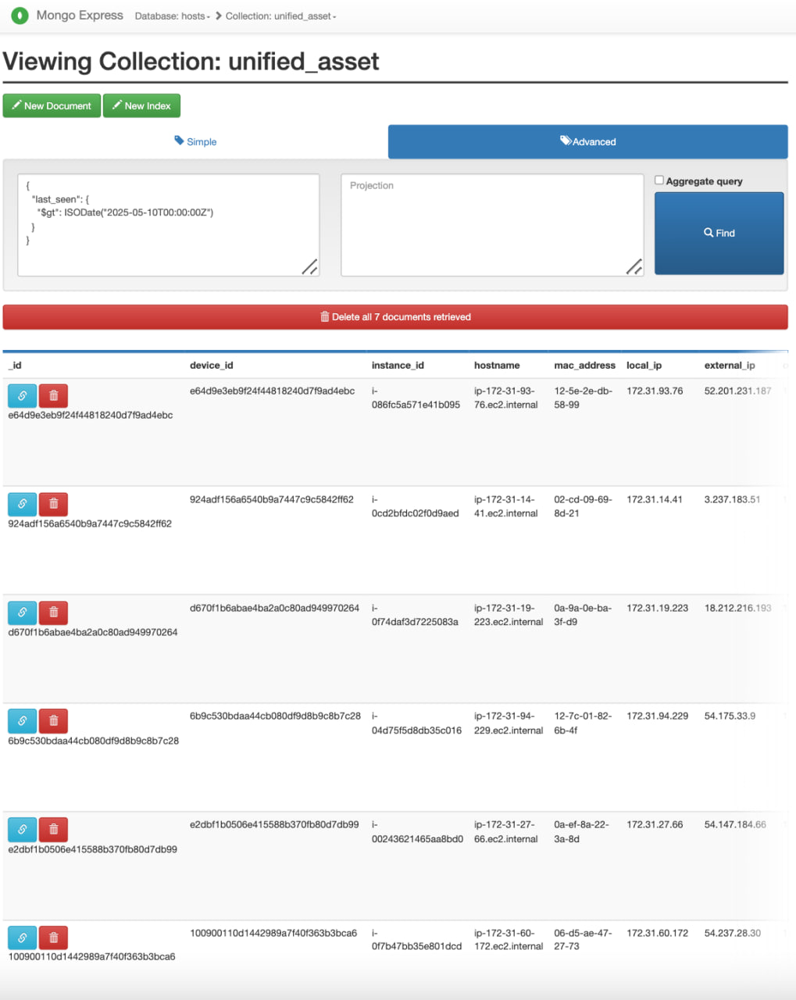
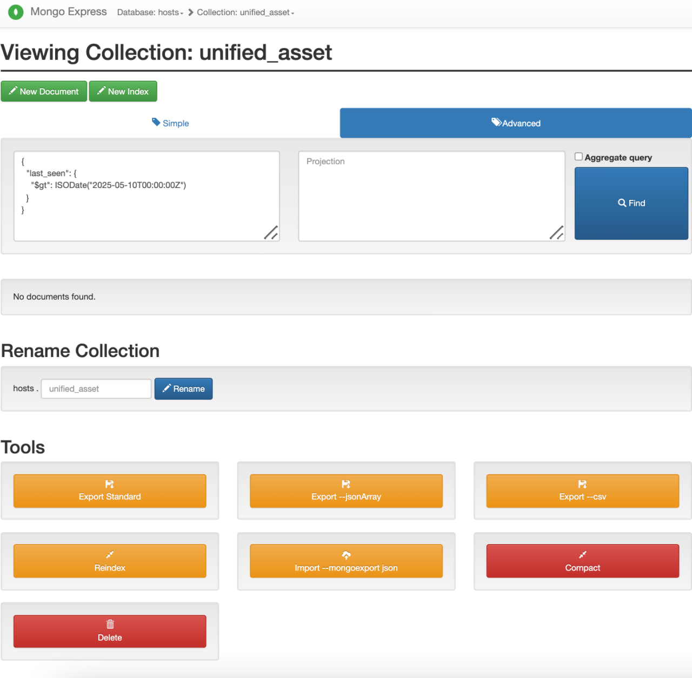
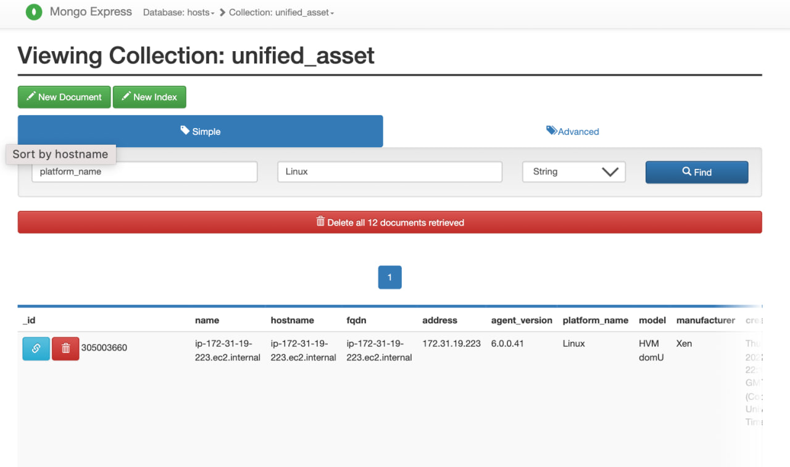
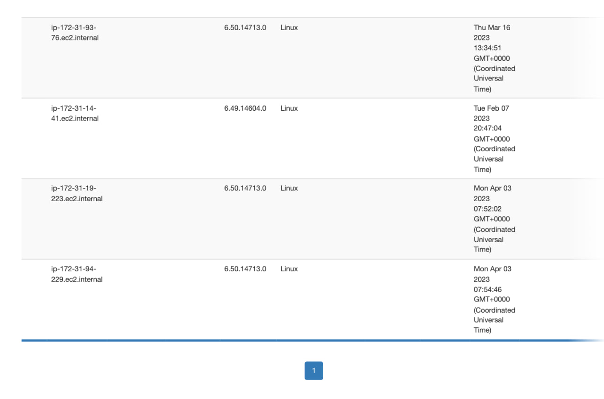
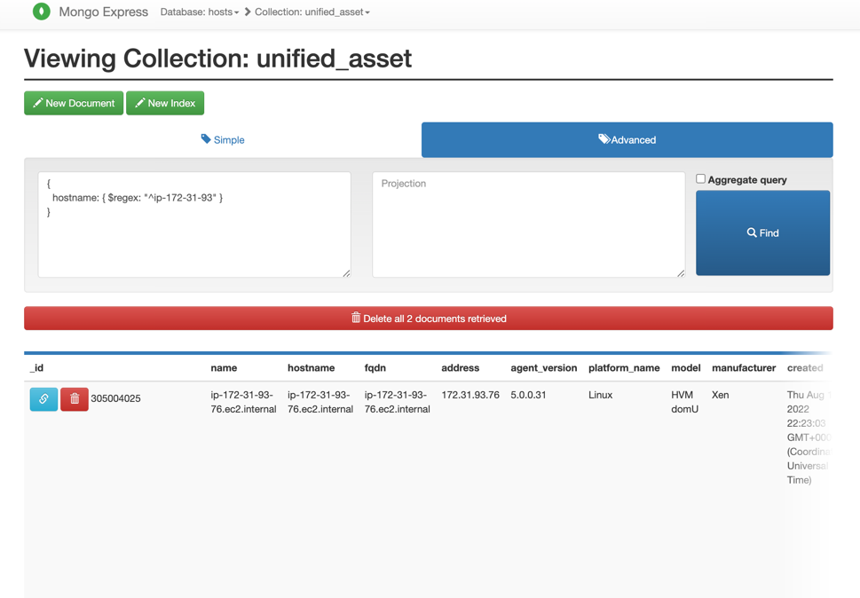
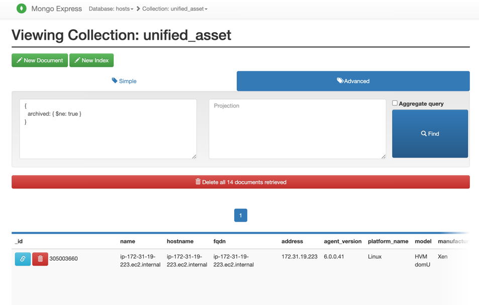

How to run:
1. cd .../silk_pipeline
2. docker should be running on your PC
3. docker-compose up -d 
   or
   3.1. docker-compose build --no-cache
   3.2. docker-compose up -d --force-recreate
4. docker exec -it fetching sh
5. python3 main.py
  Usage:
1. Used MongoDB Express for data vizualization as this is a built-in tool that can be used without reinventing the wheel
2. MongoDB dashboard: http://localhost:8081/db/hosts/unified_asset
2. Distribution of host by operating system, for example: http://localhost:8081/db/hosts/unified_asset?key=platform_name&value=Linux&type=S
3. Old hosts (last seen more than 30 days ago): http://localhost:8081/db/hosts/unified_asset?query=%7B%0D%0A++%22last_seen%22%3A+%7B%0D%0A++++%22%24lt%22%3A+ISODate%28%222025-04-15T00%3A00%3A00Z%22%29%0D%0A++%7D%0D%0A%7D%0D%0A&projection=
4. Newly discovered hosts: http://localhost:8081/db/hosts/unified_asset?query=%7B%0D%0A++%22last_seen%22%3A+%7B%0D%0A++++%22%24gt%22%3A+ISODate%28%222025-05-10T00%3A00%3A00Z%22%29%0D%0A++%7D%0D%0A%7D%0D%0A&projection=
5. Find by hostname with regex: http://localhost:8081/db/hosts/unified_asset?query=%7B%0D%0A++hostname%3A+%7B+%24regex%3A+%22%5Eip-172-31-93%22+%7D%0D%0A%7D&projection=
6. All active (non-archived) documents: http://localhost:8081/db/hosts/unified_asset?query=%7B%0D%0A++archived%3A+%7B+%24ne%3A+true+%7D%0D%0A%7D&projection=
8. Screenshots:

